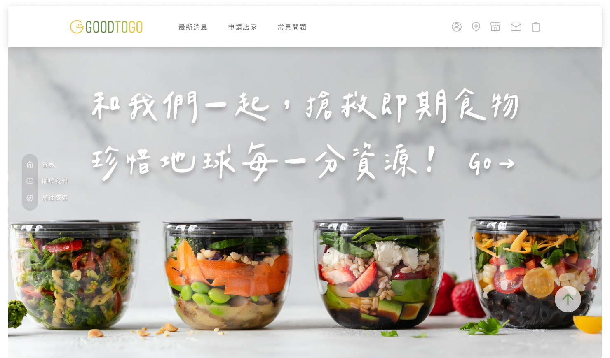

<p align="center">
    

 </p>
<h1 align="center"> GOODTOGO 即期美食平台</h1>
<div align="center">
   
  
  

</div>

## ✨ 關於 GOODTOGO
                                                                                           
<p align="center">
 
 </p>                                                                                           
                                                                                           
減少剩食以愛護地球為理念所創建的平台，提供商家販售即將到期的食品、申請為
會員的使用者於網站上購買即期食物，並藉由網站傳達惜食的觀念，幫助降低因人
類產生過多的碳排放，期許將良好的用意、理念，透過平台讓更多人一起加入行
動。

## 🌱 專案Demo
[Youtube影片連結](https://youtu.be/qhXxDpclSNk)
                                                                 
> 更多詳細資料請參閱我們的[企劃書](https://github.com/dosskkr/GOODTOGO/blob/main/GOODTOGO%20%E4%BC%81%E5%8A%83%E6%9B%B8.pdf) 
                                                                                                                                                          
## 🛠 使用方式
 > p.s. 此專案仍在加強維護階段，若造成不便敬請見諒，我們隨時歡迎前輩指示      

#### 1. 複製專案到本地環境並在 main branch 運行
```bash
$ git clone https://github.com/dosskkr/GOODTOGO.git
$ cd GOODTOGO                                                          
```
                                                                 
#### 2. 匯入或執行 goodtogodata.sql 
                                                                 
#### 3. 到後端檔案(be) 安裝套件並啟用後端
                                                                 
```bash
$ cd be
$ npm i
$ npm run dev
```
#### 4. 到前端檔案(fe) 安裝套件並啟用
                                                                 
```bash
$ cd fe
$ npm i
$ npm start
```
                                                                
